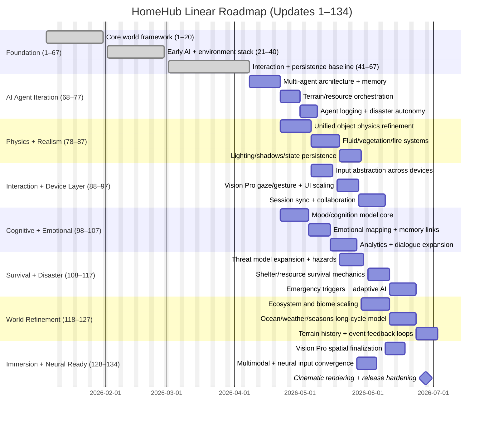

# HomeHub 134-Update Visual Roadmap

This roadmap visualizes updates **1–134** with emphasis on the newly aligned **68–134 package**, including dependencies, milestones, and estimated implementation windows for **iOS**, **Vision Pro**, and **PWA**.

## Timeline View (Mermaid Gantt)

## Dependency Map (Critical Chain)

1. **Foundation (1–67)** gates all downstream systems.
2. **AI agent core (68–77)** is required before advanced cognition and autonomous survival tuning.
3. **Physics realism (78–87)** must stabilize before world refinement (118–127) and disaster balancing (108–117).
4. **Interaction layer (88–97)** enables multi-device quality and Vision Pro readiness.
5. **Cognitive layer (98–107)** should mature before neural input convergence (128–134).
6. **Survival/disaster iteration (108–117)** and **world refinement (118–127)** feed final cinematic and immersion pass.

## Milestones

- **M1 — Core Continuity Locked (1–67 complete):** baseline simulation and persistence intact.
- **M2 — Agent Intelligence Milestone (77):** multi-agent orchestration and adaptive behavior stable.
- **M3 — Realism Milestone (87):** physics, fluid, vegetation, and lighting systems production-ready.
- **M4 — Device Layer Milestone (97):** cross-device input and sync integrated.
- **M5 — Cognitive Layer Milestone (107):** emotional/cognitive stack and analytics functional.
- **M6 — Survival Milestone (117):** hazard response and adaptive disaster logic operational.
- **M7 — World Ecology Milestone (127):** long-cycle ecosystems and planetary behavior stable.
- **M8 — Immersive Launch Milestone (134):** Vision Pro + neural-ready + cinematic rendering aligned.

## Estimated Implementation Time by Update Block

| Update Range | Theme | Estimated Duration | Parallelization Notes |
|---|---|---:|---|
| 68–77 | Advanced AI agent iteration | 4–5 weeks | Can overlap with early physics setup |
| 78–87 | Simulation realism and physics | 5–6 weeks | Physics and rendering teams can parallelize |
| 88–97 | User interaction + multi-device control | 4–5 weeks | Device adapters can ship incrementally |
| 98–107 | Cognitive/emotional expansion | 4–5 weeks | Analytics and dialogue can run in parallel |
| 108–117 | Survival/disaster iteration | 4–5 weeks | Scenario authoring parallel with AI tuning |
| 118–127 | World/environment refinement | 4–5 weeks | Biome and weather tracks can parallelize |
| 128–134 | Neural-ready + Vision Pro immersion | 3–4 weeks | Final convergence and polish sprint |

## Platform Delivery Alignment

| Platform | Primary Focus in 68–134 | Readiness by 134 |
|---|---|---|
| iOS | Touch, haptics, adaptive UI/HUD, voice context | Full feature parity for core simulation controls |
| PWA | Session sync, collaboration, keyboard/mouse/controller interoperability | Stable shared-simulation runtime |
| Vision Pro | Spatial scenes, gaze/gesture, immersive rendering, emotional feedback loops | Flagship immersive experience |

## Suggested Execution Rhythm

- **Weekly:** integration checkpoints per block with replayable simulation seeds.
- **Bi-weekly:** cross-platform parity review (iOS/PWA/Vision Pro).
- **Per milestone:** freeze window for tuning, telemetry review, and regression testing.
- **Final 2 weeks before 134:** cinematic optimization + end-to-end resilience hardening.

